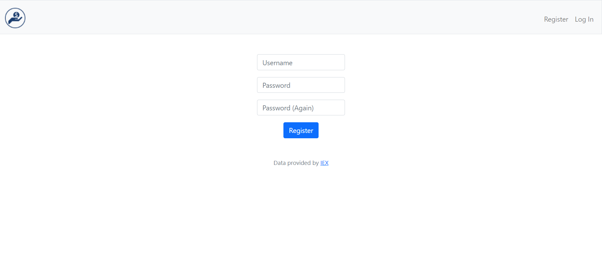
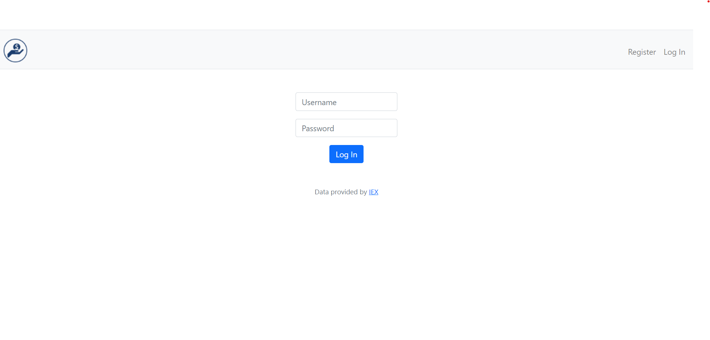
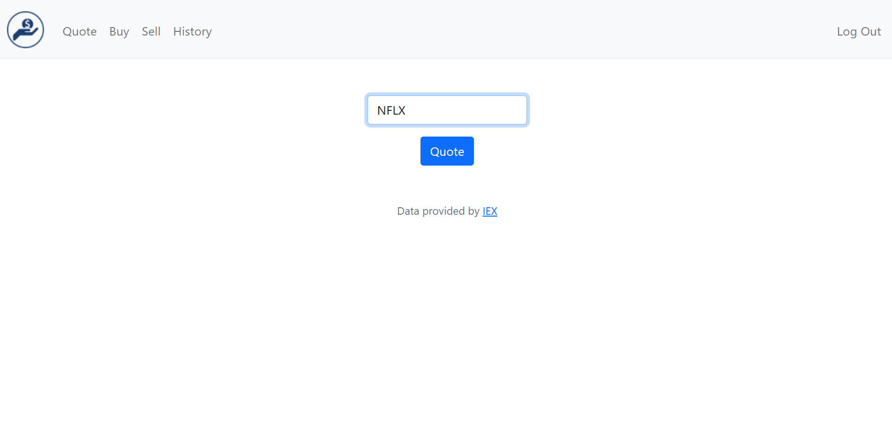
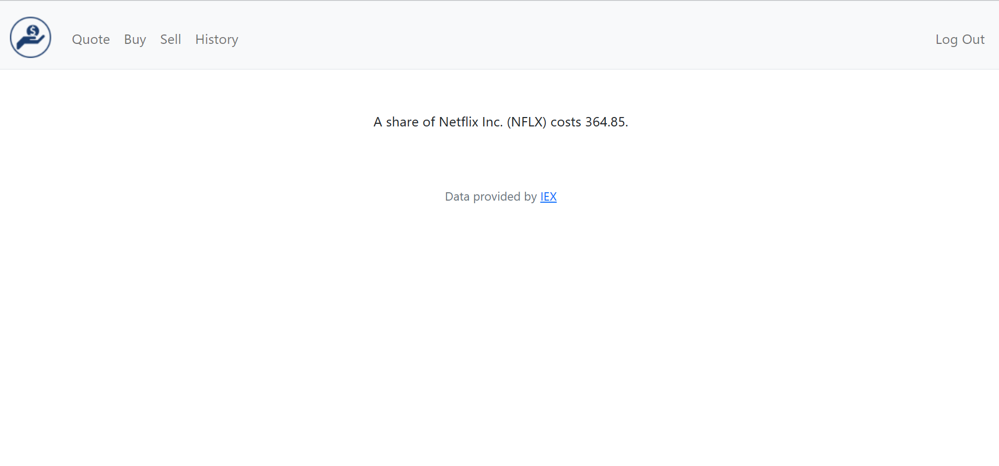
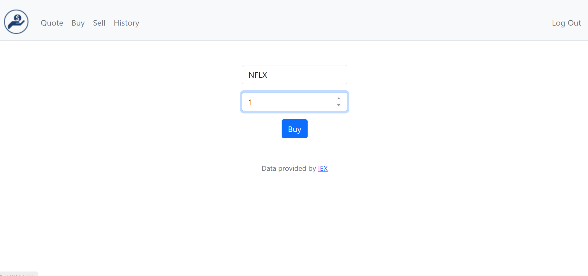
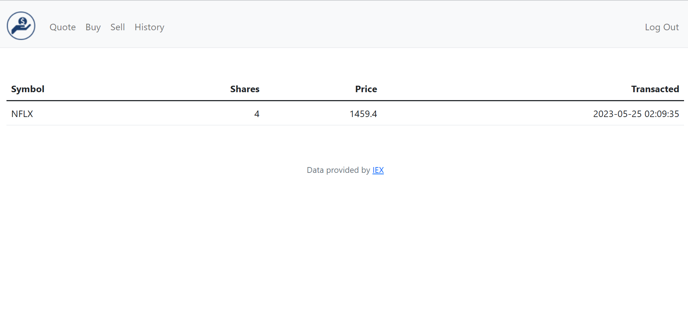

# EcomFinance
A simple ecommerce Flask application

# Description

This is a web-based platform built using the Flask framework, which allows users to engage in online buying and selling of stocks by querying IEX API for stocks’ prices. The application provides a straightforward and user-friendly interface for user to browse and purchase products, while also enabling users to sell their stocks.

# How to run?

## On Windows
### step 1: Create a virtual enviroment
  `$python -m venv /path/to/new/virtual/environment`
### step 2: Install required dependencies
  `$pip install -r requirements.txt`
### step 3: Run the application
  `$python manage.py`
  
# How to use? 

### Step1: Create an account
  
  
### Step2: Login
  
  
### Step3: Verify a stock price from IEX
  
  
  
  
### Step4: Buy the stock
  
  
### Step5: Check your history
  
  
### Step6: Sell your stock
### Step7: Check your history

# Inspiration
This program was written to demostrate how to use the Flask framework to build web applications, the program was originally given as a problem set on CS50X, it explains the basics of how to do user authentication, query an API, work with databases - doing CRUD operations - and implimenting the eCommerce business logics
